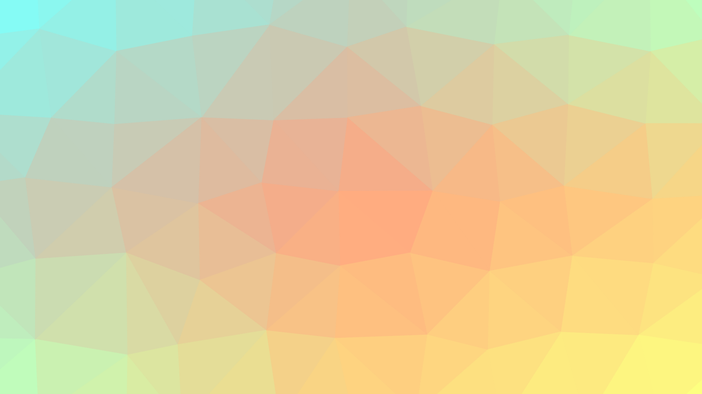

# TrianglifySwift

[](http://cocoapods.org/pods/TrianglifySwift)
[](http://cocoapods.org/pods/TrianglifySwift)
[](http://cocoapods.org/pods/TrianglifySwift)

Algorithmically generated triangle art:



# Quickstart

### Adding default random triangles view to your View Controller

```swift
let trianglesView = TriangleContainer()
self.view.addSubview(trianglesView)
```

### Adding configurable triangles to your View

```swift
let verticesConfig = VerticesGenerator.Configuration(size: self.bounds.size)
let vertices = VerticesGenerator.generate(configuration: verticesConfig)
let triangles = Delaunay.triangulate(vertices)
let style = self.trianglesStyle ?? Style() // provide options to style here
for triangle in triangles {
    let triangleView = TriangleView(triangle:triangle, style: style)
    self.triangleViews.append(triangleView)
    self.addSubview(triangleView)
}
```

See example project for animation and styling examples.

## Example

To run the example project, clone the repo, and run as usual.

# Configuration
## Triangles Generation
### Vertices
You can supply your own vertices for triangles generation or use `VericesGenerator` and supply appropriate `Configuration`. `Configuration` accepts next arguments:
### size
Width and height of the area which is used to generate vertices.

### cellSize
Float, defaults to `80.0`. Specify the size of the mesh used to generate triangles.

Larger values will result in coarser patterns, smaller values will result in finer patterns. Note that very small values may dramatically increase generation time.

### variance
Decimal value between 0 and 1 (inclusive), defaults to `0.75`. Specify the amount of randomness used when generating triangles.

### seed
Unsigned integer, defaults to `arc4random()`. Seeds the random number generator to create repeatable patterns. 

When set to `arc4random()`, the random number will be seeded with random values. Pass the same value all the time if you want triangles to not change between runs.

## Triangles Styling
### colorsX, colorsY

Array of `UIColors` used for color gradient on the x/y axis. Default is 3 random colors.

Valid array values should specify the color stops (i.e.`[UIColor.cyan, UIColor.yellow, UIColor.orange, UIColor.blue]`).

### fillColorClosure, strokeColorClosure

Specify a custom closure for coloring triangles, defaults is closure producing gradient. Accepts a function to override the standard gradient coloring that takes the triangle and returns a color that triangle should have.

```swift
let rainbowColorClosure: (TriangleView) -> UIColor = { triangleView in
    let point = triangleView.relativePositionInSuperview()
    let color = UIColor(hue: (point.x + point.y) / 2.0, saturation: 0.8, brightness: 0.8, alpha: 1)
    return color
}
TrianglifySwift.Style(fillColorClosure:rainbowColorClosure,
                     strokeColorClosure:rainbowColorClosure)
```

### strokeLineWidth

Float, defaults to `0.51`. Specify the width of the stroke on triangle shapes in the pattern. The default value is used for eliminating antialiasing artifacts (gaps) when shape layers are rendered.


# Installation
## Requirements
iOS 9+

Swift 3

## Carthage
To use latest release add this to Cartfile:

```ruby
git "https://github.com/BohdanOrlov/TrianglifySwift"

```
Then run in terminal:

```bash
$ carthage update

```

## CocoaPods
TrianglifySwift is available through [CocoaPods](http://cocoapods.org). To install
it, simply add the following line to your Podfile:

```ruby
pod "TrianglifySwift"
```

Due to Swift 3, you have to add this to the end of Podfile:

```ruby
post_install do |installer|
    installer.pods_project.targets.each do |target|
        target.build_configurations.each do |config|
            config.build_settings['SWIFT_VERSION'] = '3.0'
        end
    end
end 
```

## Author

Bohdan Orlov, bohdan.orlov@corp.badoo.com

### Credits

Emerged from:

Original [Trianglify JS](https://github.com/qrohlf/trianglify)

Swift Delaunay Triangulation [Trianglify JS](https://github.com/AlexLittlejohn/DelaunaySwift)


## License

TrianglifySwift is available under the MIT license. See the LICENSE file for more info.
